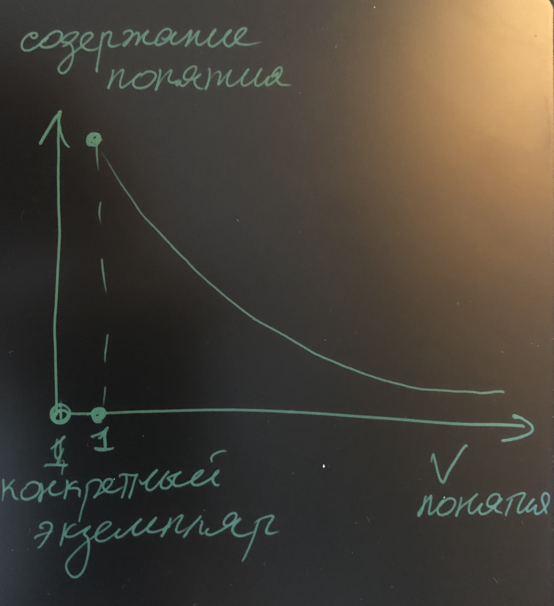
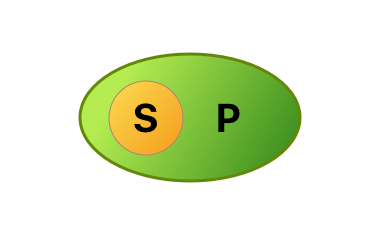
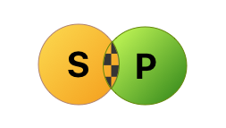

# А.И. Уемов "Логические ошибки. Как они мешают правильно мыслить

## 1. Сущность логических ошибок

`Логическая ошибка` - это неправильная связь между мысоями, которая существует на самом деле

Мысли, которые возникают в голове челоека зависят от него. Но от него не зависит истинность или ложность этих мыслей. Если истинность и ложность мыслей не зависит от человека, то должны существовать и независимые от воли и желаний людей отношения между истинностью и ложностью различных мыслей.

Если человек неправильно отражает в своих мыслях отношения мужду вещами, то он можт искажать и отношения между истинностью и ложностью различных мыслей.

`Неистинность мысли` - Искажение отношений реального мира. 
`Неправильность мысли` - искажение отношений между мыслями.

Каждая мысль может быть истина, но устновленная связь может быть непраивльной. Ошибки связанные с истинностью мыслей, т.е. искажений в мыслях отношений между предметами и явлениями окружающей действительности, называются `фактическими`.

Ошибки, связанные с неправильностью мысли, то есть с искажением связей между самими мыслями, являются `логическими`.

## 2. В чем вред логических ошибок

В зависимости от правильных или неправильных связей между мыслями будет зависеть истинность или ложность сделанного вывода.

Логические ошибки не всегда приводят к фактическим. Явно `абсурдные` логические ошибки легко вычислить. Не очевидные ошибки вляются причинной многочисленных `заблуждений`.

## 3. Причины возникновения логических ошибок

Причина в том, что многие неправильные мысли похожи на правильные. Чем большее сходство, тем труднее заметить ошибку.

Пример. План сочинения

`Неправильный!`
1. Вступление. Историческое значение романа
2. Изложение 
    a) Война в романе
    б) Народность войны
    в) Партизанское движение
3. Заключение

`Правильный!`

1. Действие регулярной русской армии
2. Поддержка русской армии народом 
    а) В тылу русской армии
    б) В тылу захватчиков (партизанское движение)

`Софизм` - ложное утрвеждение с логической ошибкой, которое выдается за истинное.

`Парадокс Эватла и Протагора`  (оплата обучения после первого выигранного дела в суде)

Способность человека замечать различие между правильными и неправильными мыслями зависит от внимания, которое он напраляет на эти мысли. Чем больше внимания, тем больше деталей можно заметить.

`Направленность внимания` зависит от интересов людей.

<b>В.И. Ленин:</b> <i>если бы геометрические аксиомы задевали интересы людей, то и они опровергались бы. Нельзя думать что классовый интерес ясно осознается. Часто человек, выражающий классовые интересы, вовсе не ставит задачу защищать эти интересы. Сознательно или бессознательно, человек под влиянием `своих` интересов принимает одни доводы и отбрасывает другие. Поэтому в рассуждениях он может не заметить `грубой` логической ошибки. </i>

Различие интересов из парадокса Эватла и Протагора не было классовым. Логическая ошибка обусловлена частным желанием наживы. Влияние такого частного интереса можно наблюдать постоянно. Под влиянием аффекта правильное может показаться неправильным и наоборот.

В следствии необходимо различать 2 стороны:
1) правильность или неправильность мыслей самих по себе
2) в какой мере люди чувствуют и осознают эту правильность или неправильность
   
В соответствии с двумя следствиями можно говорить о доказательности (1) и убедительности (2).

Некоторые мысли могут быть доказательными, но не убедительными, если это противоречит интересам людей.

<b>Доказать ложное утвеждение нельзя, но убедить можно.</b>

Во всей истории, каждый раз когда нужно было обосновать ложную мысль, то действовали на чувства, отсутствие доказательности заменяли убедильностью.

В некоторых случах причино логической ошибки может оказаться недосток знаний, который прикодит к фактической ошибке.

Обе группы ошибок (фактические/логические) не существуют изолированно.

Логическая ошибка может привести к фактической и наоборот. Фактическая ошибка приводит к логичиеской.

Распространенная причина логических ошибок является просто незнание людьми того, что такое правильность мысли и как отличить ее от неправильности.

## 4. Значение практики и различных наук для устранения логических ошибок

Сталкиваясь с различными ситуациями стихийно, из своей жизненной практики можно узнать что правильно, а что нет, но в конкретной узкой области.

Такая стихийнася правильность называется `здравым смыслом`.

Типы рассужлдений в различных науках отличаются
`(Какие типы существуют???)`

Как бы хорошо ни были изучены науки, они могут дать лишь практический навык тех или иных рассуждений. Выявить ошибку сможет, а объяснить и показать почему неправильно, сможет в лучшем случае ан материале своей науки.

## 5. Как логика помогает бороться с логическими ошибками.

### Логический формы мыслей

1) Что такое логическая форма

(чтобы не описывать правило для каждой мысли)

Необходимо сформулировать общие правила.

`Аналогия` - грамматика описывающее общие правила для работы со словами.
Как и в примере с грамматикой также решает свою задачу и логика. Как геометрия, отвлекаясь от конкретных физических свойств тел, изучает геометрические формы, как грамматика, отвлекаясь от конкретного значения слов и предложений изучает грамматические формы так и `логика, отвлекаясь от конкретного содержания мыслей, изучает логические формы мышления`, т.е. их строение, представлеяющее собой совокупность соотношений между элементами этих мыслей.

2) `Понятие`

Такая логическая форма, в которой признаки, существенные для тех или иных предметов или явлений мысляться как существующие вместе. 

Существенные признаки, которые мысляться в понятии о предмете образуют `содержание понятия`.

Круг предметов, в которым относится данное понятие называется `объемом понятия`.

`Общий объем понятия` - когда в него входит много предметов.
`Единичный объем понятия` - когда объект один.

`???`
Если 2 или 3 объекта, это тоже общий объем понятия? `???`

3) `Суждение`

Понятия не сущствуют изолировано, они включаются или исключаются из других понятий.

Связь одних понятий с другими, утверждается или отрицается определенное отношение одного понятия к другому.

В сууждении выделяются 3 элемента:
- `Субъект суждения` - понятие обозначающее то, о чем говориться
- `Сказуемое или предикат` - то что говориться о субъекте
- `Связка` - показывающая утверждается или отрицается тот или иной признак о предмете (является, относится, представляет собой, есть и т.д.)

`Суждение` имеет общую структуру.
Получаемые формы суждения:

S есть P или S не есть P.

Суждения делятся:
- `утвердительные` - суждения с положительной связкой
- `отрицательные` - суждения с отрицательной связкой

Отличия помимо связки:

В суждениях моежт и дти речь о всех предметах или явлениях, входящих в объем понятия субъекта, в других же лишь о части этих предметов или явлений.

- Общеутвердительное суждение: `Все S есть P`
- Общеотрицательное суждение: `Все S не есть P`

В логике `"некоторые"` - часть либо ВСЕ.

`S и P находится в определенном соотношении по Объему.`

#### Пример 1:

`Все S есть P`

S - видовое понятие
P - родовое понятие
S к P относится как вид к роду.

#### Пример 2:

`Ни одно S не является P`

#### Пример 3:

`Некоторые S есть P`

#### Пример 4:

`Некоторые S не есть P`

В тесной связи с отношением понятий по объему находится очень важное понятие распределенности терминов в суждении. 

`Терминами суждения` называют `субъект` и `предикат`.

Если в суждении идет речь обо всем объеме S и P, тогда эти термины считаются `распределенными`.

Если в суждении идет речь о какой-то части `S` или `P`, тогда эти термины считаются `НЕ распределенными`.

Распределение в разных суждениях:
* В общеутвердительном (`Все S есть P`) субъект распределен, а предикат - нет, так как предикат может быть больше субъекта.
* В частноутвердительном субъект и предикат не распределены.
* В общеотрицательном субъект и предикат распределены.
* В частноотрицательном: субъект не распределн, предикат - распределен.

Различие между общеотрицательными и частноотрицательными суждениями:
1) Субъект всегда распределен в общих суждениях
2) Предикат всегда распределен только в отрицательных суждениях

**В чем особенность распределенных суждений?**

Возможны суждения, где субъект и предика охватывают не одно, а 2 и более понятий.